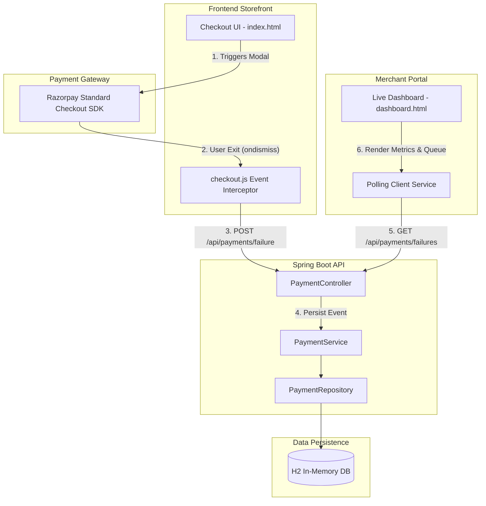
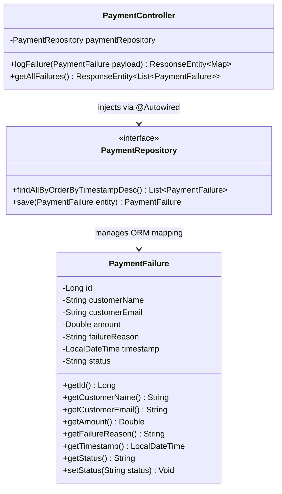
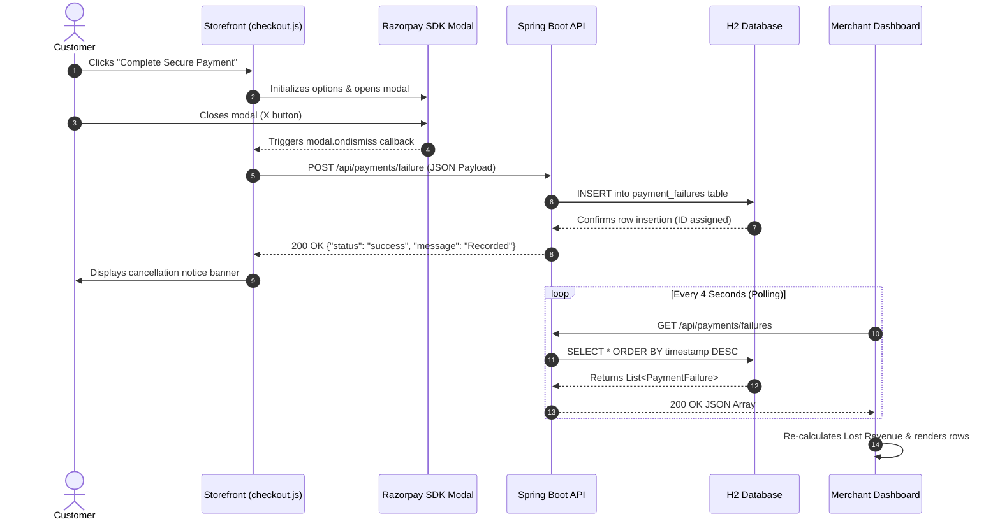

```markdown
# 🚀 RevRecover — Autonomous Revenue Recovery Platform

[](https://spring.io/projects/spring-boot)
[](https://razorpay.com/)
[](https://www.h2database.com/)
[](https://tailwindcss.com/)

 
RevRecover is a real-time payment recovery platform engineered to intercept checkout abandonments at the exact millisecond they occur. Built for the Razorpay Buildathon, this platform bridges the gap between payment gateway drop-offs and actionable merchant recovery strategies. By tapping into Razorpay's native checkout hooks and a high-performance Spring Boot API, RevRecover logs failures into a live diagnostic dashboard, empowering merchants to initiate AI-assisted recovery nudges immediately.

---

## 🎯 Problem & Solution

**The Core Challenge:**  
E-commerce businesses lose significant revenue due to cart abandonment. Up to 70% of online checkout attempts end in drop-offs or failures (network disruptions, user hesitation, closed tabs) without merchant visibility. Standard analytics only indicate that a user left; they do not capture payment intent, context, or actionable follow-up vectors.

**The RevRecover Solution:**  
RevRecover introduces a real-time interception layer. Instead of waiting for asynchronous server webhooks from completed transactions, RevRecover actively monitors the Razorpay checkout iframe lifecycle. When a user exits the modal or experiences a failure, the client captures session metadata (Name, Email, Intended Amount, Reason) and posts it to a merchant diagnostic queue.
 
---


## 🏗️ System Architecture & Engineering Design

### 1. High-Level System Architecture



 
### 2. Comprehensive Class Diagram (UML)



 
### 3. Complete End-to-End Sequence Flow


 
---

## 💻 Tech Stack & Infrastructure Specifications

| Layer | Technology | Specification & Role |
| --- | --- | --- |
| **Frontend UI** | HTML5 / Tailwind CSS | Utility-first, responsive interface with no external bundle overhead. |
| **Client Engine** | JavaScript (ES6+) | Handles DOM manipulation, Razorpay SDK lifecycle events, and fetch requests. |
| **Gateway SDK** | Razorpay Standard Checkout | Embedded payment modal exposing `handler` and `modal.ondismiss` hooks. |
| **Backend Server** | Spring Boot 3.x (Java 17+) | REST API engine, JSON serialization, dependency injection, and CORS management. |
| **Persistence** | Spring Data JPA / Hibernate | Object-Relational Mapping (ORM) layer executing SQL generation. |
| **Database** | H2 Database Engine | In-memory DB running at `jdbc:h2:mem:testdb` with built-in web console. |

 
---

## ⚙️ Core Mechanics: Detailed Execution Steps

### Interception Layer

The standard Razorpay integration listens primarily to successful payment callbacks. RevRecover binds to the `modal.ondismiss` lifecycle handler inside `js/checkout.js`:

```javascript
modal: {
    ondismiss: function () {
        fetch("http://localhost:8080/api/payments/failure", {
            method: "POST",
            headers: { "Content-Type": "application/json" },
            body: JSON.stringify({
                customerName: name,
                customerEmail: email,
                amount: 4999.00,
                failureReason: "Payment window closed by user"
            })
        });
    }
}

```

### Ingestion & Persistence Layer

The Spring Boot REST controller intercepts incoming requests, binds them to the `PaymentFailure` entity model, and persists them into H2 storage:

```java
@RestController
@RequestMapping("/api/payments")
@CrossOrigin(origins = "*")
public class PaymentController {

    @Autowired
    private PaymentRepository paymentRepository;

    @PostMapping("/failure")
    public ResponseEntity<Map<String, Object>> logFailure(@RequestBody PaymentFailure failure) {
        failure.setTimestamp(LocalDateTime.now());
        PaymentFailure saved = paymentRepository.save(failure);
        
        Map<String, Object> response = new HashMap<>();
        response.put("status", "success");
        response.put("message", "Payment failure recorded");
        response.put("data", saved);
        return ResponseEntity.ok(response);
    }
}

```
 
---

## 🔌 API Reference & Endpoints

### 1. Log Payment Failure Event

* **HTTP Method:** `POST`
* **Route:** `/api/payments/failure`
* **Content-Type:** `application/json`

**Sample Request Payload:**

```json
{
    "customerName": "Monika",
    "customerEmail": "jkmonika@gmail.com",
    "amount": 4999.00,
    "failureReason": "Payment window closed by user"
}

```

**Sample Response Payload (200 OK):**

```json
{
    "status": "success",
    "message": "Payment failure recorded",
    "data": {
        "id": 5,
        "customerName": "Monika",
        "customerEmail": "jkmonika@gmail.com",
        "amount": 4999.0,
        "failureReason": "Payment window closed by user",
        "timestamp": "2026-09-05T19:00:00.123456"
    }
}

```
 
### 2. Fetch All Logged Failures

* **HTTP Method:** `GET`
* **Route:** `/api/payments/failures`
* **Content-Type:** `application/json`

**Sample Response Payload (200 OK):**

```json
[
    {
        "id": 5,
        "customerName": "Monika",
        "customerEmail": "jkmonika@gmail.com",
        "amount": 4999.0,
        "failureReason": "Payment window closed by user",
        "timestamp": "2026-09-05T19:00:00.123456"
    }
]

```
 
---

## 🚀 Local Deployment & Running Guide

### System Prerequisites

* **Java Development Kit (JDK) 17** or higher installed.
* **Apache Maven 3.8+** configured in environment path.
* A web browser (Google Chrome, Microsoft Edge, or Mozilla Firefox).
* VS Code with **Live Server Extension** (recommended for static file serving).
* Active **Razorpay Test Key ID**.

### Step 1: Repository Cloning

```bash
git clone [https://github.com/Sanjaithun/Razopay](https://github.com/Sanjaithun/Razopay)
cd revenue-recovery-razorpay

```

### Step 2: Key Configuration

1. Open `frontend/js/checkout.js`.
2. Locate the Razorpay options variable.
3. Insert your Razorpay Test Key:
```javascript
key: "rzp_test_YOUR_API_KEY_HERE"

```


### Step 3: Launch Spring Boot Backend

From the root directory containing `pom.xml`, execute:

```bash
# Unix/Linux/macOS
./mvnw spring-boot:run

# Windows Command Prompt / PowerShell
mvnw.cmd spring-boot:run

```

* Server initialized at: `http://localhost:8080`
* H2 Database Console: `http://localhost:8080/h2-console` (JDBC URL: `jdbc:h2:mem:testdb`, User: `sa`, Password: *blank*)

### Step 4: Serve Frontend Applications

1. Open the `/frontend` directory in VS Code.
2. Click **Go Live** on the bottom status bar to serve static files on `http://127.0.0.1:5500`.
3. Open two browser windows:
* **Customer Storefront:** `http://127.0.0.1:5500/index.html`
* **Merchant Dashboard:** `http://127.0.0.1:5500/dashboard.html`


### Step 5: Verify Functional Recovery Workflow

1. Navigate to `index.html`, enter customer information, and click **Complete Secure Payment**.
2. When the Razorpay iframe opens, click the **X** button to simulate user abandonment.
3. Check `dashboard.html` to verify that the failure is ingested, metric cards recalculate, and the incident appears in the queue.

 
---

## 📜 License & Acknowledgements

* **License:** Distributed under the MIT License.
* **Hackathon:** Developed exclusively for the **Razorpay Buildathon**.


```